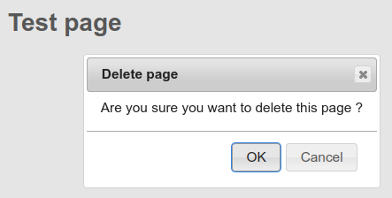

# Delete Page Button Plugin for DokuWiki

Copyright (c) 2020 Damien Regad <dregad@mantisbt.org>

The plugin adds a _Delete page_ button to DokuWiki's
[PageMenu](https://www.dokuwiki.org/devel:menus).

This provides a simpler, quicker and more intuitive way for users to
delete wiki pages, compared to the
[documented page deletion method](https://www.dokuwiki.org/page#delete_a_page).

If JavaScript is enabled 
and the current [Template](https://www.dokuwiki.org/template) 
is supported by the plugin, 
a confirmation dialog will be displayed prior to deleting the page.

## License

This program is free software; you can redistribute it and/or modify
it under the terms of the
[GNU General Public License, version 2](https://www.gnu.org/licenses/old-licenses/gpl-2.0.html)
or later.

This program is distributed in the hope that it will be useful,
but WITHOUT ANY WARRANTY; without even the implied warranty of
MERCHANTABILITY or FITNESS FOR A PARTICULAR PURPOSE.  See the
GNU General Public License for more details.

## Installation and Configuration

Please refer to
[the plugin's wiki page](https://www.dokuwiki.org/plugin:deletepagebutton)
for information on how to install and configure this plugin in DokuWiki.

If you install this plugin manually, make sure it is installed in
`lib/plugins/deletepagebutton/` - if the folder is called differently,
it will not work!

## Compatibility

This plugin has been tested with the following DokuWiki releases,
and should work with later versions as well.
- 2018-04-22b "Greebo"
- 2020-07-29 "Hogfather"

Earlier releases are not supported.

The plugin has been tested with the default
[DokuWiki](https://www.dokuwiki.org/template:dokuwiki) and the
[Bootstrap3](https://www.dokuwiki.org/template:bootstrap3) 
Templates.
Other Templates should work as well, as long as they use the same markup for 
Page Tools; otherwise, the page will be deleted without confirmation. 

## Support

Source code and support for this plugin can be found at
<https://github.com/dregad/dokuwiki-plugin-deletepagebutton>

## Credits

Icon: <https://materialdesignicons.com/icon/trash-can-outline>

I first thought I could adapt
[this old plugin](https://github.com/caillou/dokuwiki-plugin-delete)
but I ended up restarting from scratch.
